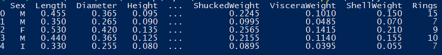
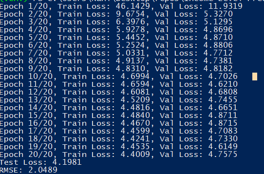
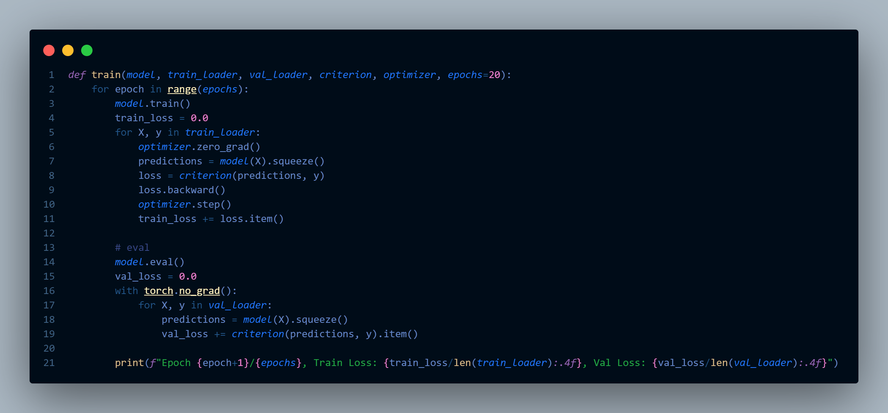

# Abalone-Age-Prediction

## **Overview**

This project focuses on predicting the age of abalone (sea snails) using machine learning. The dataset originates from the [UCI Machine Learning Repository](https://archive.ics.uci.edu/ml/datasets/abalone), featuring various physical measurements of abalones.

Using **PyTorch**, this project implements a regression model to predict the number of rings in abalones, which correlates directly to their age.

## **Key Features**

- **Dataset**: Preprocessed UCI Abalone Dataset with 8 features and one target variable (`Rings`).
- **Framework**: Built with **PyTorch** for scalability and modularity.
- **Performance**: Achieved a test **RMSE of 2.05** and a **MSE of 4.2**, indicating robust predictive capabilities.

### **1. Dataset Preprocessing**

- The dataset was split into **training (70%)**, **validation (15%)**, and **test (15%)** subsets.
- Features were normalized using `StandardScaler`, and categorical variables were one-hot encoded for compatibility with the model.

### **2. Model Architecture**

The regression model consists of:

- **Input Layer**: Accepts 10 features (8 continuous + 2 one-hot-encoded categories for `Sex`).
- **Hidden Layers**: Two fully connected layers with ReLU activations for non-linearity.
- **Output Layer**: Outputs a single value (predicted `Rings`).

### **3. Results**

- **Train Loss**: Decreased consistently across epochs, indicating learning.
- **Validation Loss**: Stabilized after ~15 epochs, showcasing effective generalization.
- **Test Metrics**:
  - **MSE (Mean Squared Error)**: 4.2
  - **RMSE (Root Mean Squared Error)**: 2.05

### **1. Data Preprocessing**



### **2. Training Loss per Epoch**



### **Main Model Training Code**



## **How to Run**

### **1. Clone the Repository**

```
git clone https://github.com/username/Abalone-Age-Prediction.git
cd Abalone-Age-Prediction
```

### **2. Set Up the Virtual Environment**

```
python -m venv venv
source venv/bin/activate  # On Windows: venv\Scripts\activate
pip install -r requirements.txt
```

### **3. Run the Main Script**

```
python main.py
```

## **Future Improvements**

- Get RSME under 2.0
